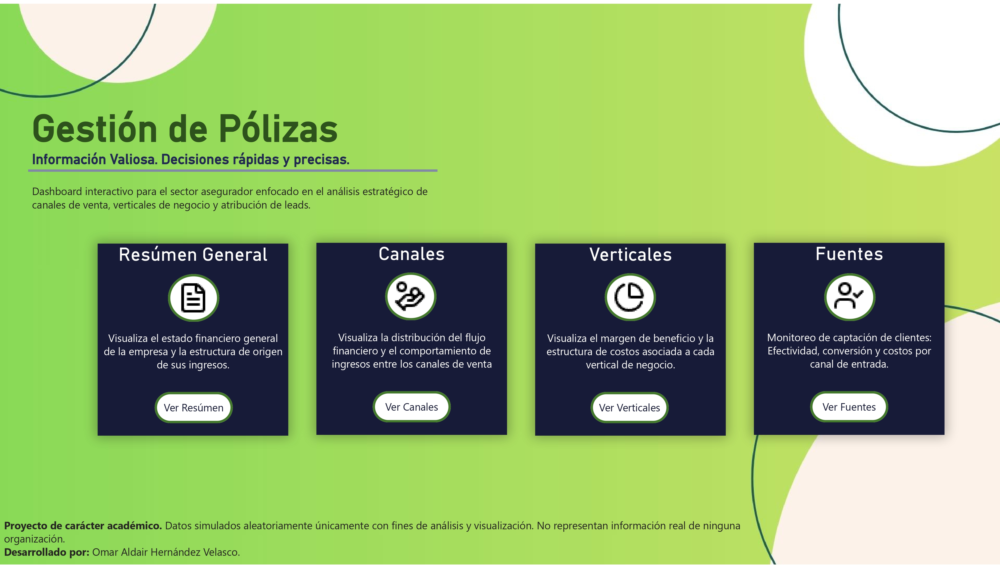
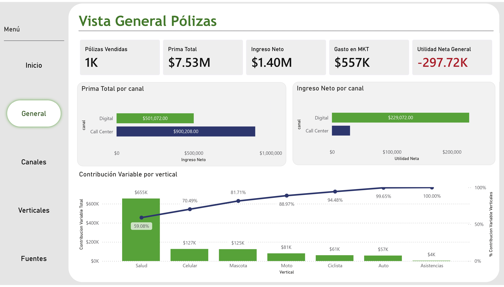
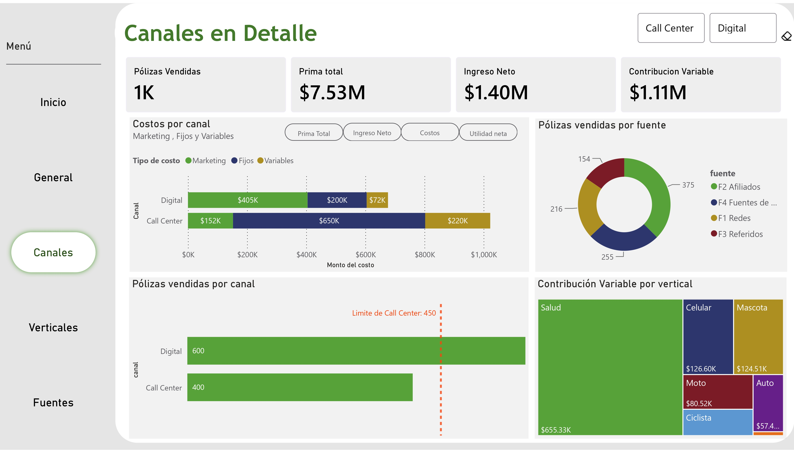
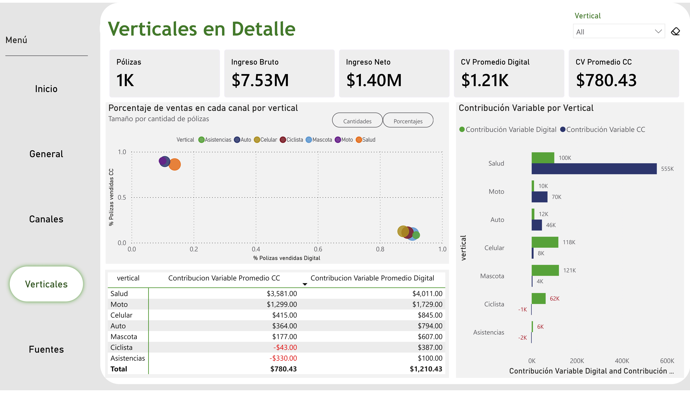
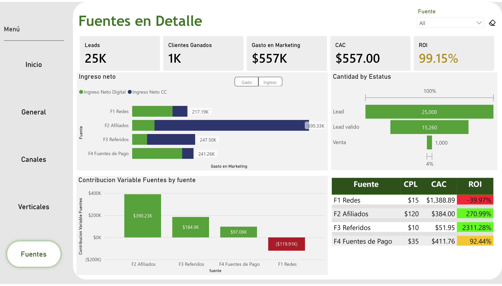

# Dashboard de Análisis Comercial de Seguros

## Descripción

Este proyecto es una solución de **Business Intelligence y análisis de datos** desarrollada en el contexto de una **compañía de seguros**. El objetivo es analizar el desempeño financiero y comercial de la empresa desde diferentes perspectivas, incluyendo ingresos, canales de venta, verticales de negocio y fuentes de captación de clientes.

El proyecto utiliza **Microsoft SQL Server** para crear y estructurar la base de datos, así como para cargar la información utilizada en el análisis. Posteriormente, **Power BI** y **DAX** se utilizan para desarrollar las métricas y construir un dashboard interactivo que facilite el análisis de los principales indicadores del negocio.

## Herramientas y Tecnologías

* **Microsoft SQL Server** — Creación y estructuración de la base de datos y carga de información.
* **Power BI** — Desarrollo del dashboard interactivo y visualización de datos.
* **DAX** — Creación de medidas y métricas de negocio.

## Estructura del Proyecto

```text
├── SQL/
│   ├── 01_create_tables.sql
│   └── 02_insert_data.sql
│
├── PowerBI/
│   └── dashboard.pbix
│
├── Imagenes/
│   ├── Inicio.jpg
│   ├── General.jpg
│   ├── Canales.jpg
│   ├── Verticales.jpg
│   └── Fuentes.jpg
│
└── README.md
```

## Dashboard

El dashboard está compuesto por cinco páginas. La página de **Inicio** funciona como punto de entrada al reporte y presenta una breve introducción al proyecto, las definiciones de cada sección y botones de navegación para acceder a las diferentes páginas.

### Inicio

Página de introducción al dashboard. Presenta el propósito del análisis, una descripción de las diferentes secciones y botones de navegación para acceder a cada página del reporte.



### Resumen General

Visualiza el estado financiero general de la empresa y la estructura de origen de sus ingresos.



### Canales

Visualiza la distribución del flujo financiero y el comportamiento de los ingresos entre los diferentes canales de venta.



### Verticales

Visualiza el margen de beneficio y la estructura de costos asociada a cada vertical de negocio.



### Fuentes

Permite monitorear la captación de clientes mediante indicadores de efectividad, conversión y costos de las diferentes fuentes de adquisición.



### Dashboard Interactivo

[Ver Dashboard Interactivo en Power BI](https://app.powerbi.com/view?r=eyJrIjoiODZhYWU2ODMtOWUxYi00NzU1LWEzZWMtMGFhMjFhMzM3M2U3IiwidCI6Ijg2YTZiZTFjLTM4NjEtNDE3Zi05ODJkLWQ3Mjg1YjYyNzhhOCJ9&pageName=5aa7f9c734775ee5c019)

## SQL

Los scripts SQL fueron desarrollados utilizando **Microsoft SQL Server** y están organizados en dos etapas:

### `01_create_tables.sql`

Crea las tablas de la base de datos y define su estructura para representar la información utilizada en el proyecto.

### `02_insert_data.sql`

Inserta los datos utilizados posteriormente en el análisis y en el dashboard de Power BI.

## Objetivo

El objetivo principal de este proyecto es demostrar el uso de **SQL Server, Power BI y DAX** para convertir datos estructurados de una compañía de seguros en información útil para el análisis financiero y comercial.

El dashboard permite explorar diferentes dimensiones del negocio y facilita la identificación de patrones y diferencias en el desempeño de los canales de venta, verticales de negocio y fuentes de captación de clientes.

## Aviso

> **Los datos utilizados en este proyecto son completamente ficticios y no representan a empresas, clientes, transacciones, pólizas ni información financiera reales. Este proyecto fue creado exclusivamente con fines académicos, educativos y de portafolio.**
